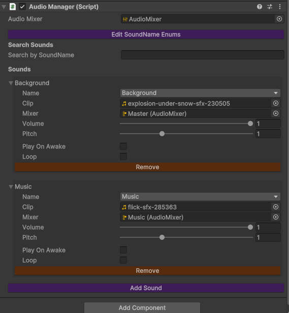
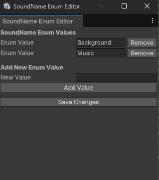

<p align="center">
  
</p>

# 🎵 GameDevFishy Audio Manager

**A lightweight, editor-integrated audio management system for Unity.**  
Easily manage, play, and configure sound effects and music through an intuitive UI and powerful scriptable API.


---

## 🖼️ Screenshots

### 🎛 AudioManager Inspector


### 🔠 Enum Editor Window


---


## 🌟 Features

- 🎚️ **Centralized Audio Control** – Play, pause, stop, and configure audio clips from one place.
- 🧠 **Enum-Based Sound Selection** – Uses a strongly-typed `SoundName` enum for error-free sound calls.
- 🛠️ **Custom Editor Inspector** – Enhanced inspector with search bar, per-sound controls, and styling.
- 📝 **Enum Editor Window** – Add or remove sound names via a dedicated editor window (no manual editing).
- 🎧 **Audio Mixer Support** – Control master, music, and SFX levels with linear-to-decibel conversion.
- 🔄 **Mixer Auto-Assign** – Automatically finds and assigns a mixer if missing.
- 🔍 **Search & Filter** – Quickly find and edit specific sounds in large sound libraries.
- ⚙️ **Customizable Per Sound** – Modify volume, pitch, looping, AudioClip, and play-on-awake.

---

## 📦 Installation

1. **Clone or Download** this repository.
2. Copy the `AudioManager/` folder into your Unity project's `Assets/` directory.

### 📁 Folder Structure

```
Assets/
└── AudioManager/
    ├── Mixer/
    │   └── AudioMixer.mixer
    ├── Prefabs/
    │   └── AudioManager.prefab
    ├── Scripts/
    │   ├── AudioManager.cs
    │   ├── AudioManagerEditor.cs
    │   ├── SoundNameEditorWindow.cs
    │   └── SoundNames.cs
    └── Images/
        └── thumbnail.png
```

---

## 🚀 Quick Start

### 1. Drag the Prefab

Add `AudioManager.prefab` to your scene.

### 2. Add Sounds

In the Inspector:
- Click **"Add Sound"**
- Set `AudioClip`, `SoundName`, `Volume`, `Pitch`, etc.

### 3. Create or Assign Audio Mixer

If no mixer is assigned:
- Click **"Get Mixer"** in the Inspector to automatically find the default one.

---

## 🧪 Usage in Code

### ▶️ Playing Audio

```csharp
AudioManager.instance.Play(SoundName.Music);
AudioManager.instance.PlayOneShot(SoundName.Explosion);
```

### 🔈 Changing Settings

```csharp
AudioManager.instance.SetVolume(SoundName.Click, 0.7f);
AudioManager.instance.SetPitch(SoundName.Click, 1.2f);
```

### 🎚️ Controlling Mixer Volumes

```csharp
AudioManager.instance.SetMasterVolume(0.8f);
AudioManager.instance.SetMusicVolume(0.5f);
AudioManager.instance.SetSFXVolume(1.0f);
```

### ⏸️ Checking & Controlling Playback

```csharp
if (AudioManager.instance.IsSoundPlaying(SoundName.Background))
    Debug.Log("Background music is playing!");

AudioManager.instance.Pause(SoundName.Background);
AudioManager.instance.UnPause(SoundName.Background);
AudioManager.instance.Stop(SoundName.Background);
```

---

## 🎨 Custom Editor Tools

### 🔠 SoundName Editor Window

Access from: `Window > SoundName Editor`

- Add or remove `SoundName` enum values via UI.
- Automatically updates `SoundNames.cs` and refreshes Unity.

### 🛠 AudioManager Inspector

- **Search bar** for filtering sounds
- **Color-coded UI**: Orange buttons to remove, purple to add/edit
- **Get Mixer** button auto-finds `AudioMixer.mixer` if missing

---

## ⚙️ Sound Configuration

Each sound includes:
- 🎵 `AudioClip`
- 🎛️ Volume (0–1)
- 🎚️ Pitch (0.1–3)
- 🔁 Loop toggle
- ▶️ Play on Awake
- 🎚️ Mixer group (optional)

---

## 📋 Requirements

- Unity **2019.4+**
- Uses built-in `AudioSource`, `AudioMixer`, and `UnityEditor` APIs

---

## 🐞 Troubleshooting

| Issue | Solution |
|-------|----------|
| **Audio Mixer not assigned** | Use "Get Mixer" button in Inspector |
| **Sound not playing** | Make sure the AudioClip and SoundName are correctly set |
| **Enum not updating** | After editing in the SoundName Editor, click "Save Changes" |

---

## 💡 Tips

- Group music and SFX into separate AudioMixerGroups for independent control.
- Expose `MasterVolume`, `MusicVolume`, and `SFXVolume` parameters in the mixer.
- Use `playOnAwake` for background loops that should start automatically.

---

## 📜 License

Licensed under the **MIT License**.  
Feel free to use, modify, and distribute.

---

## 👥 Credits

Built with ❤️ by **GameDevFishy**.  
Thanks to the Unity community for inspiration and support.

---

<p align="center"><strong>🎧 Happy Audio Managing!</strong></p>
