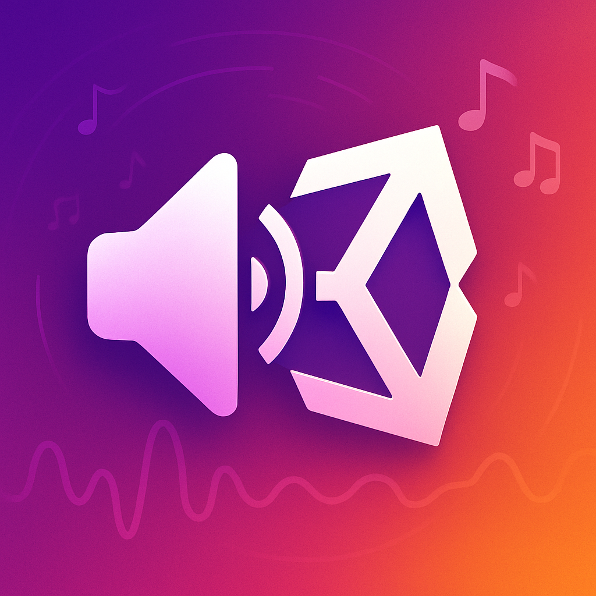

  

# 🎵 GameDevFishy Audio Manager

**A lightweight, editor-integrated audio management system for Unity.**  
Easily manage, play, and configure sound effects and music through an intuitive UI and powerful scriptable API.

---

## 🌟 Features

- 🎚️ **Centralized Audio Control** – Play, pause, stop, and configure audio clips from one place.
- 🧠 **Enum-Based Sound Selection** – Uses a strongly-typed `SoundName` enum for error-free sound calls.
- 🛠️ **Custom Editor Inspector** – Enhanced inspector with search bar, per-sound controls, and styling.
- 📝 **Enum Editor Window** – Add or remove sound names via a dedicated editor window (no manual editing).
- 🎧 **Audio Mixer Support** – Control master, music, and SFX levels with linear-to-decibel conversion.
- 🔄 **Mixer Auto-Assign** – Automatically finds and assigns a mixer if missing.
- 🔍 **Search & Filter** – Quickly find and edit specific sounds in large sound libraries.
- ⚙️ **Customizable Per Sound** – Modify volume, pitch, looping, AudioClip, and play-on-awake.

---

## 📦 Installation

1. **Clone or Download** this repository.
2. Copy the `AudioManager/` folder into your Unity project's `Assets/` directory.

### 📁 Folder Structure

